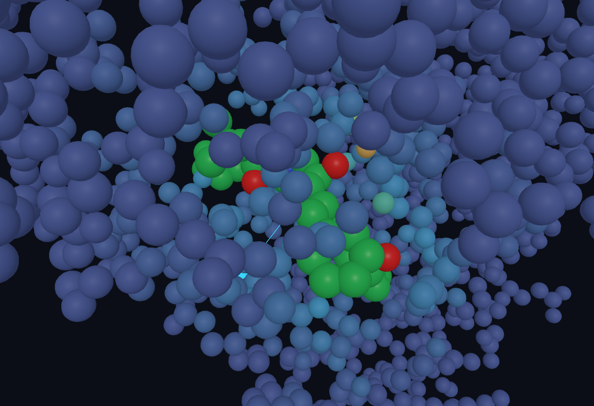
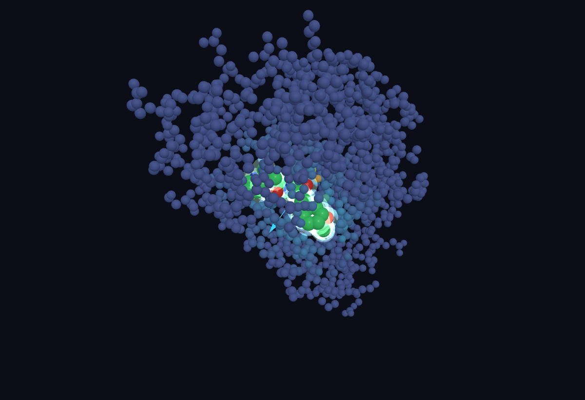
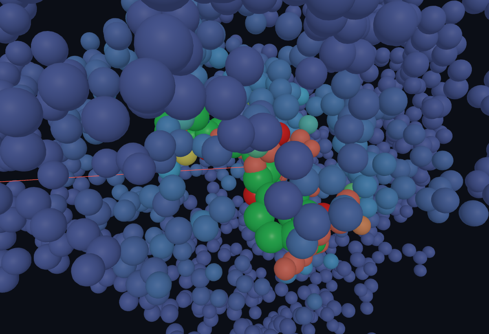

# Protein Force Graph — web

Interactive, **physics-only** visualization of protein–ligand interactions, in the browser.

Drag a ligand around a protein and watch the **force on every residue update in real time** —
each atom colored blue→red by how hard the ligand pushes or pulls it. Every number on screen is a
transparent physical rule (Lennard-Jones + Coulomb), **not** a machine-learning prediction.



> This is an **explainer / intuition** tool — *not* a docking or binding-affinity predictor.
> See [Honest scope](#honest-scope).

The default scene is **1HSG**: HIV-1 protease bound to the inhibitor indinavir (MK1).

---

## Features

- **Live per-residue force heatmap.** The net force each protein atom feels from the ligand
  (Newton's 3rd law) is mapped blue (low) → red (high). The binding pocket lights up as the ligand
  approaches, and flares red on a steric clash.
- **Drag the ligand.** Grab the green ligand and move it; the van der Waals + electrostatic energy
  and the net-force arrow recompute on every pointer move — no precomputation, no lookup tables.
- **Transparent energy panel.** van der Waals and electrostatic interaction energy in kcal/mol,
  plus the net-force magnitude. (A force-field *estimate* — not ΔG.)
- **Net-force arrow.** Direction + magnitude of the total force on the ligand; cyan when
  net-attractive, red when net-repulsive.
- **Load any structure.** Load an arbitrary protein **PDB**, and a ligand from **SDF / MOL / PDB**,
  via the buttons or by drag-and-drop. A loaded ligand is a full participant in the force field —
  identical physics to the built-in one.

| The whole protein, pocket glowing | Push the ligand into the wall → clash |
| :---: | :---: |
|  |  |
| Residues near the ligand are tinted by the force they feel. | Lennard-Jones r⁻¹² repulsion: the overlap turns red and the net-force arrow points back out. |

## Usage

### Run it

```bash
npm install
npm run dev
# then open the printed localhost URL (default http://localhost:5173)
```

No build step is needed to develop. To make a static build: `npm run build` (output in `dist/`).

### Controls

| Action | How |
| --- | --- |
| **Move the ligand** | Left-drag the green molecule |
| **Orbit the camera** | Left-drag empty space |
| **Zoom** | Scroll wheel |
| **Reset the ligand** | *Reset pose* button |
| **Toggle the heatmap** | *Force heatmap* button |

### Reading the screen

- **Energy panel (top-right).** *van der Waals* and *electrostatic* are the two interaction terms in
  kcal/mol; *interaction E* is their sum (negative = favorable / attractive); *|net force|* is the
  magnitude of the total force on the ligand.
- **Atom colors (heatmap on).** Each protein atom is colored by the magnitude of the force it feels
  from the ligand: **blue** (low) → cyan → green → yellow → **red** (high, i.e. a steric clash).
  With the heatmap off, atoms use standard CPK element colors. The ligand is drawn in green.
- **Net-force arrow.** Points in the direction of the total force on the ligand; **cyan** when the
  interaction is net-attractive, **red** when net-repulsive. Longer = stronger.

### Load your own protein and ligand

- **Load protein (PDB)** — pick a `.pdb` file. It replaces the scene and is re-centered automatically;
  if the file contains a HETATM ligand, that ligand is loaded too.
- **Load ligand (SDF / MOL / PDB)** — pick a ligand file. It appears just *outside* the protein so
  you can **drag it into the pocket** and watch the forces respond.
- **Drag & drop** — drop a file anywhere on the window: `.pdb` is treated as a protein,
  `.sdf` / `.mol` / `.mol2` as a ligand.

Waters are dropped on load; the ligand is detected as any non-standard `HETATM` residue (not an amino
acid, water, or ion).

### Deep-link a structure

Open a specific structure straight from the URL. `?pdb=<file>` loads a protein from `public/` (its
embedded `HETATM` ligand comes along); an optional `?lig=<file>` drops in a separate ligand. Falls
back to the bundled 1HSG demo.

- [`?pdb=1HSG.pdb`](?pdb=1HSG.pdb) — HIV-1 protease + indinavir *(default)*
- [`?pdb=1M17.pdb`](?pdb=1M17.pdb) — EGFR kinase + erlotinib

### A 30-second tour

1. The app opens on **1HSG**. The crystal pose reads roughly **vdW ≈ −49 kcal/mol** — net attractive,
   and the pocket residues glow.
2. **Drag indinavir out** of the pocket: the van der Waals term climbs toward zero (contact lost) and
   the heatmap cools to blue.
3. **Push it into the protein wall:** the overlapping residues flare **red** and *|net force|* explodes
   (Lennard-Jones r⁻¹² repulsion) — the arrow turns red and points back out.
4. **Let go near the pocket** and nudge it around to feel where the protein pulls it in.

## The physics

Everything is computed live in the browser; you can read every term in [`src/forcefield.js`](src/forcefield.js).

- **van der Waals** — Lennard-Jones 12-6, per-element parameters combined with Lorentz–Berthelot
  mixing rules.
- **Electrostatics** — Coulomb with a distance-dependent dielectric (RDIE, ε_r = 4r) and coarse
  per-element partial charges.
- **Neighbor search** — a uniform spatial grid (cell = 9 Å cutoff) keeps the per-frame force
  evaluation fast enough for real-time dragging.
- **Rendering** — Three.js `InstancedMesh` (one draw call for thousands of atoms), CPK coloring,
  and on-demand rendering (the scene re-renders only when something actually changes).

## Honest scope

The energies here are **nonbonded interaction energies** from a coarse classical force field —
useful for *intuition* about where a ligand clashes or binds, and fully transparent.

They are **not** binding free energies (ΔG). A real ΔG = ΔH − TΔS needs explicit solvent, entropy,
and conformational sampling (MM/GBSA, FEP/TI) — none of which this tool attempts. That is
deliberate: the goal is an **explainable, real-time, physics-only** picture, not an affinity
predictor.

An optional [OpenMM](https://openmm.org/) worker ([`src/openmm.js`](src/openmm.js)) can relax a
dragged pose with a real ff14SB + GAFF force field, but it requires running a separate Python
worker and is **not** needed for the in-browser physics.

## Project layout

```
index.html         overlay UI (energy panel, controls, legend)
src/main.js        scene, force loop, ligand drag, heatmap, file loaders
src/forcefield.js  Lennard-Jones + Coulomb
src/pdb.js         PDB parser (protein / ligand split)
src/sdf.js         minimal V2000 SDF / MOL parser
src/chemistry.js   element table (radii, colors)
src/openmm.js      optional OpenMM worker client
public/            demo structures (1HSG protease+indinavir, 1M17 EGFR kinase+erlotinib)
assets/            README screenshots
```

## Tech

Vite · Three.js · plain ES modules.
