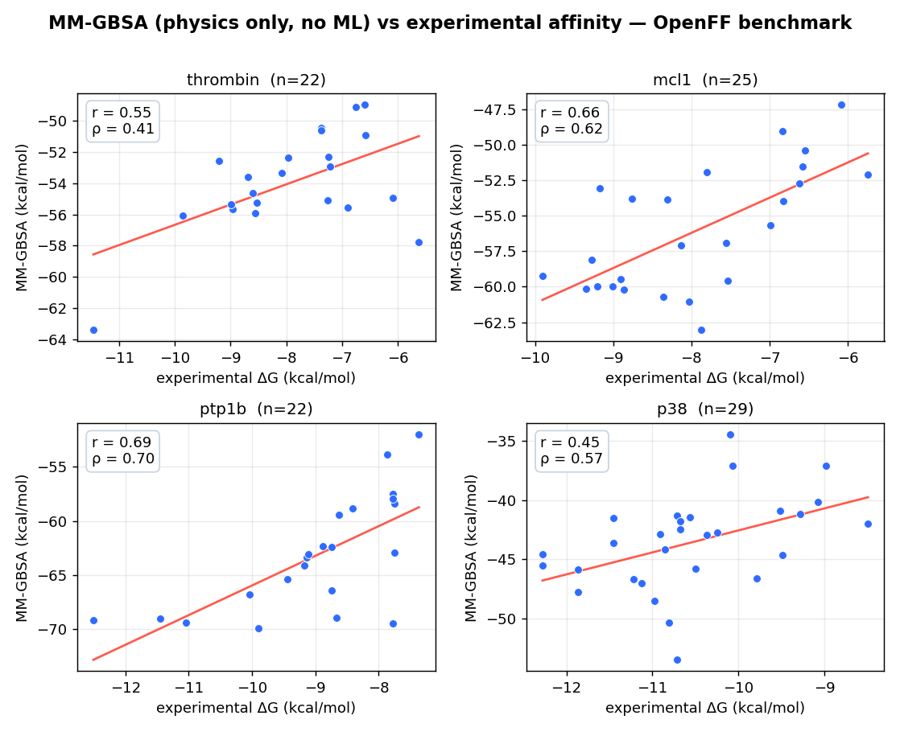
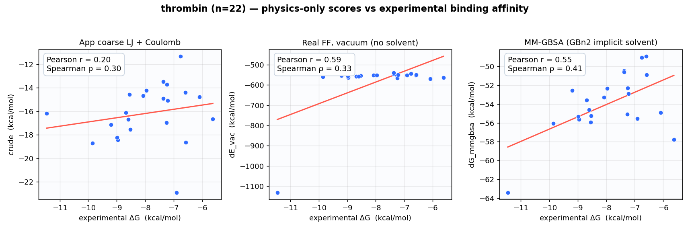

# Validation — does the physics actually track binding affinity?

The in-app score (coarse per-element LJ + Coulomb) is built for **live intuition**, not prediction.
The fair question is whether *any* of this physics, done properly, tracks real binding data. This
folder answers it with a small, fully reproducible study across **four targets / 98 ligands**.

## Setup

- **Dataset:** the [OpenFF protein–ligand benchmark](https://github.com/openforcefield/protein-ligand-benchmark)
  — four congeneric series spanning different protein classes, each with measured affinities
  (IC50 → experimental ΔG) and a prepared receptor. The same data used to benchmark binding-free-energy
  methods: **thrombin** (protease, 22), **mcl1** (protein–protein interaction, 25),
  **ptp1b** (phosphatase, 22), **p38** (kinase, 29).
- **Score:** single-trajectory **MM-GBSA**, physics-only, no ML, no fitting —
  `ΔG = E(complex) − E(receptor) − E(ligand)` with **GBn2 implicit solvent**, on the energy-minimized
  complex. For comparison we also score each ligand with the web app's **coarse LJ + Coulomb**
  interaction and with the **real force field in vacuum** (no solvent).
- **Pipeline:** `antechamber` (AM1-BCC) → `parmchk2` → `tleap` (ff14SB + GAFF2, mbondi3 radii) →
  OpenMM (CUDA) GBn2 minimization + single-point energies. Scripts: [`mmgbsa_validate.py`](mmgbsa_validate.py),
  [`mmgbsa_plot.py`](mmgbsa_plot.py), [`mmgbsa_summary.py`](mmgbsa_summary.py). Raw numbers:
  `*_results.csv`.

## Result — it generalizes



| target | class | n | app score (r / ρ) | **MM-GBSA (r / ρ)** |
| --- | --- | :---: | :---: | :---: |
| thrombin | protease | 22 | 0.20 / 0.30 | 0.55 / 0.41 |
| mcl1 | PPI | 25 | 0.11 / 0.15 | 0.66 / 0.62 |
| ptp1b | phosphatase | 22 | 0.58 / 0.38 | 0.69 / 0.70 |
| p38 | kinase | 29 | 0.42 / 0.40 | 0.45 / 0.57 |
| **mean** | | **98** | **0.33 / 0.31** | **0.59 / 0.57** |

(r = Pearson, ρ = Spearman rank correlation, vs experimental ΔG.)

**MM-GBSA beats the coarse app score on the rank metric (Spearman) for every one of the four targets**,
with a mean ρ ≈ 0.57 across 98 ligands — while the app's coarse score is weak and inconsistent
(mean ρ ≈ 0.31). Same physics, taken to a real force field with solvent, goes from a qualitative
cartoon to a useful ranker — and it holds across a protease, a PPI, a phosphatase, and a kinase.

### Detailed example (thrombin): coarse → real-FF → MM-GBSA



The progression is clear: the app's coarse score is essentially uncorrelated (r = 0.20); the real
force field with implicit solvent recovers a real, statistically-significant signal
(MM-GBSA r = 0.55, p ≈ 0.008). (The vacuum Pearson looks high only because one high-leverage outlier
pulls the line — on the outlier-robust rank correlation, MM-GBSA wins.)

## Honest scope

This is **single-snapshot** MM-GBSA. It is **not** FEP accuracy, and the absolute numbers are **not**
ΔG — note the y-axes: MM-GBSA over-stabilizes by tens of kcal/mol by design, so only the *ranking* is
meaningful. Short-MD conformational averaging and an entropy term are the obvious next steps to push
the correlation higher. The point here is narrow and honest: the underlying physics, done rigorously,
**ranks real binding affinity** on a standard benchmark — receipts (plots, data, scripts) included.

## Reproduce

```bash
# conda env with: openmm, ambertools, openff-toolkit, openmmforcefields, rdkit, scipy, matplotlib, pandas, pyyaml
git clone --filter=blob:none --sparse https://github.com/openforcefield/protein-ligand-benchmark ~/pfg-val
cd ~/pfg-val && git sparse-checkout set data
for t in thrombin mcl1 ptp1b p38; do python mmgbsa_validate.py $t; done   # resumable
python mmgbsa_summary.py mmgbsa_targets.png thrombin mcl1 ptp1b p38
```
